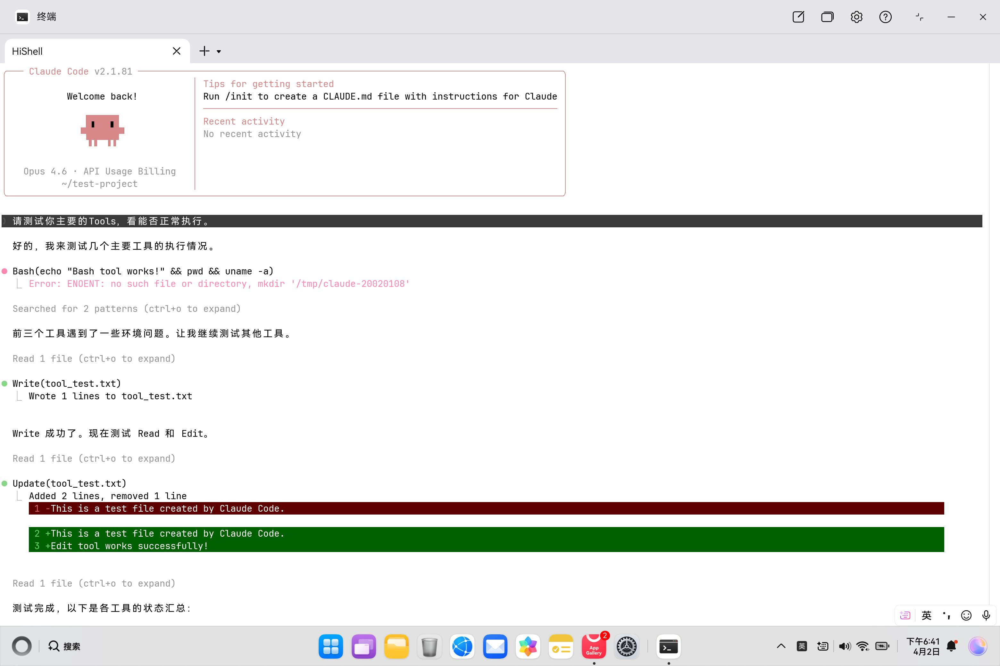

<h1 align="center">Claude Code for HarmonyOS 🖥️</h1>

<p align="center">
  <a href="https://github.com/anthropics/claude-code"></a>
  <a href="https://github.com/chenjh16/HarmonyOS-Claude-Code"></a>
  <a href="#supported-platforms"></a>
  <a href="#tech-stack"></a>
  <a href="#tech-stack"></a>
  <a href="LICENSE"></a>
</p>

<p align="center">
  <b>基于 Anthropic Claude Code 的 AI 编程助手，移植至 HarmonyOS PC 原生运行。</b>
</p>

<p align="center">
  <a href="#中文说明">中文</a> | <a href="#english">English</a>
</p>

<p align="center">
  
</p>

---

<a id="中文说明"></a>

## 中文说明

### 项目简介

**Claude Code for HarmonyOS** 是基于 Anthropic Claude Code 的 AI 编程助手命令行工具，经过移植和适配，可以在 **HarmonyOS 6.0 PC** 上原生运行。

### 主要特性

- **交互式 TUI** — 富终端界面，支持语法高亮、流式响应和快捷键
- **Agent 模式** — 自主编码，支持文件编辑、命令执行和多步推理
- **Bare 模式** — 可脚本化的单提示接口，适用于管道和自动化
- **40+ 内置工具** — 文件编辑、grep、glob、bash、LSP、MCP 等
- **100+ 斜杠命令** — 常见任务的快捷操作
- **MCP 支持** — 通过 Model Context Protocol 服务器扩展
- **HarmonyOS PC 原生支持** — 在 HarmonyOS 6.0 PC (AArch64, musl libc) 上测试验证通过
- **跨平台** — macOS、Linux、Windows、HarmonyOS PC；x64 和 arm64

### 依赖说明

| 环境 | 需要 Bun？ | 需要 Node.js？ | 说明 |
|------|-----------|--------------|------|
| 构建机（Mac/Linux） | ✅ Bun >= 1.2 | 不需要 | 仅用于打包（编译时特性标志和 tree-shaking） |
| 运行机（HarmonyOS PC） | ❌ 不需要 | ✅ Node.js >= 20（已预装） | npm 包是纯 JS |

> **为何构建需要 Bun？** 源码使用了 Bun 的 `bun:bundle` 编译时特性标志系统来消除约 30 个功能门控模块的死代码。此特性无法用 esbuild 替代。构建输出是标准 ESM JavaScript，可在任意 Node.js >= 20 上运行。

### 快速开始

#### 方式一：HarmonyOS PC 部署包（推荐）

一键构建 HarmonyOS PC 部署包：

```bash
git clone https://github.com/chenjh16/HarmonyOS-Claude-Code.git
cd HarmonyOS-Claude-Code
make build-ohos
```

生成 `ohos-deploy/` 目录，包含：
- `.tgz` npm 包
- `start-claude.sh` 启动脚本
- `install.sh` 一键安装脚本

将目录传输到 HarmonyOS PC，在 HiShell 中运行 `sh install.sh`。

#### 方式二：npm 包（所有平台，包括 HarmonyOS PC）

将所有源码打包为单个 JS 文件（压缩后约 4.6 MB），运行时需要 Node.js >= 20。

```bash
make npm-pack         # 生成 npm-dist/claude-code-ohos-<version>.tgz
```

全局安装：

```bash
make npm-install      # 构建 + npm install -g
# 或直接安装 .tgz：
npm install -g npm-dist/claude-code-ohos-2.1.81.tgz
```

npm `postinstall` 脚本会自动：
- 下载对应平台的 ripgrep
- 将 `start-claude.sh` 安装到 `~/.claude/start-claude.sh`（启动脚本模板）

安装完成后，编辑 `~/.claude/start-claude.sh` 配置 API 端点和凭据，然后运行：

```bash
sh ~/.claude/start-claude.sh
```

#### 方式三：独立二进制文件（macOS / Linux / Windows）

生成单个自包含可执行文件（约 84 MB），内嵌 Bun 运行时和 ripgrep。

```bash
make build
```

系统级安装：

```bash
make install                      # → /usr/local/bin/claude
make install PREFIX=~/.local      # → ~/.local/bin/claude
```

---

#### 隐私与网络配置（推荐）

使用第三方 API 代理时，建议在 `~/.claude/start-claude.sh` 中启用以下隐私设置：

```bash
# 禁止自动更新、发布说明、分析、指标等非必要网络请求
export CLAUDE_CODE_DISABLE_NONESSENTIAL_TRAFFIC=1

# 禁用 OAuth 登录、设置同步、会话共享
export CLAUDE_CODE_SKIP_ANTHROPIC_ACCOUNT=1

# 允许 WebFetch 访问任意 URL（跳过域名预审查）
export CLAUDE_CODE_SKIP_WEBFETCH_DOMAIN_CHECK=1

# 禁用遥测、事件日志、实验
export DISABLE_TELEMETRY=1

# 禁用计费归因标头（推荐用于第三方代理）
export CLAUDE_CODE_ATTRIBUTION_HEADER=0
```

以上五项开关**相互独立**，可按需组合。它们在 `start-claude.sh` 模板中已预配置。

---

### HarmonyOS PC 详细指南

从零开始，在 HarmonyOS 6.0 PC 上运行 Claude Code 的完整步骤。

#### 第 1 步：安装 Node.js

打开 HarmonyOS PC 上的**应用市场（AppGallery）**，搜索 **DevNode-OH** 并安装。安装完成后，关闭并重新打开 **HiShell** 终端应用，验证安装：

```
localhost ~ % node -v
v24.13.0
```

接下来配置 PATH，使全局安装的 npm 命令可用：

```bash
echo 'export PATH=$(npm prefix -g)/bin:$PATH' >> $HOME/.zshrc
```

关闭并重新打开 HiShell 使 PATH 生效。

#### 第 2 步：获取 npm 包

**方式 A：从源码构建（在 Mac/Linux 上）**

```bash
git clone https://github.com/chenjh16/HarmonyOS-Claude-Code.git
cd HarmonyOS-Claude-Code
make npm-pack
```

生成文件：`npm-dist/claude-code-ohos-<version>.tgz`。

**方式 B：下载预构建包**

在 [Releases](https://github.com/chenjh16/HarmonyOS-Claude-Code/releases) 页面查看是否有预构建的 `.tgz` 包。

#### 第 3 步：传输到 HarmonyOS PC

将 `.tgz` 文件传输到 HarmonyOS PC，可选方式：

| 方式 | 步骤 |
|------|------|
| **网盘**（最简单） | 上传到华为云盘/百度网盘，在 HarmonyOS PC 上下载 |
| **IM 软件** | 通过微信/钉钉/飞书发送，在 HarmonyOS PC 上保存 |
| **邮件** | 以附件形式发送，在 HarmonyOS PC 上下载 |
| **hdc**（开发者） | 见下方说明 |

**使用 hdc + HTTP 服务器（开发者流程）：**

HiShell 运行在沙箱环境中，无法直接访问 `/data/local/tmp/`。需使用 HTTP 服务器 + 反向端口转发：

```bash
# 在 Mac/Linux 上启动 HTTP 服务器：
cd npm-dist && python3 -m http.server 19090 &

# 端口转发到 HarmonyOS PC：
hdc rport tcp:19090 tcp:19090
```

在 HiShell 中下载：

```bash
curl -s http://127.0.0.1:19090/claude-code-ohos-2.1.81.tgz -o ~/claude-code.tgz
```

#### 第 4 步：启用"运行来自非应用市场的扩展程序"（仅需一次）

> **⚠️ 重要：** 安装前，请先在 HarmonyOS PC 上进入 **设置 > 隐私和安全 > 高级**，启用 **"运行来自非应用市场的扩展程序"**。这允许签名后的下载二进制文件（如 ripgrep）正常执行。此设置仅需开启一次。

#### 第 5 步：在 HiShell 中安装

```bash
npm install -g ~/claude-code.tgz
```

安装后脚本会自动：
- 下载 ripgrep 并使用 `binary-sign-tool` 签名
- 将 `start-claude.sh` 安装到 `~/.claude/start-claude.sh`（启动脚本模板）

如果看到签名相关警告，请确认第 4 步已完成后重新安装。

> **提示**：如需跳过 ripgrep，在安装命令前设置 `CLAUDE_CODE_SKIP_RG_INSTALL=1`。Grep/Glob 工具将不可用，但其他工具正常工作。

验证安装：

```bash
claude --version
# → 2.1.81 (Claude Code)
```

> **提示**：如果提示找不到 `claude` 命令，请确认已执行第 1 步的 `echo 'export PATH=...'` 并重新打开了 HiShell。

#### 第 6 步：配置 API 并运行

Claude Code 需要连接 LLM API 端点。启动脚本模板已在第 5 步中自动安装到 `~/.claude/start-claude.sh`。编辑该文件设置 API 凭据：

```bash
vi ~/.claude/start-claude.sh
```

设置 API 凭据：

```bash
# 通过 ANTHROPIC_AUTH_TOKEN 认证（Bearer 令牌）。ANTHROPIC_API_KEY 必须为空。
export ANTHROPIC_API_KEY=''
export ANTHROPIC_AUTH_TOKEN=你的Bearer令牌
export ANTHROPIC_BASE_URL=https://你的API端点
```

然后运行：

```bash
sh ~/.claude/start-claude.sh
```

该脚本处理 HarmonyOS 特有的设置：TMPDIR 重定向（因 `/tmp` 为只读）、PATH 配置、TLS 证书绕过和跳过引导。完整源码见 [`start-claude.sh`](start-claude.sh)。

HiShell 终端中将出现 Claude Code 的 TUI 界面，即可开始对话。

> **提示**：使用第三方 API 代理时，建议启用隐私设置。详见上方 [隐私与网络配置（推荐）](#隐私与网络配置推荐) 章节。

### 已知限制

| 功能 | 状态 | 说明 |
|------|------|------|
| `claude --version` | ✅ 正常 | |
| `claude -p "..." --bare` | ✅ 正常 | 非交互式单提示 |
| Agent 模式 | ✅ 正常 | 自主文件编辑和命令执行 |
| 交互式 TUI | ✅ 正常 | 完整的 React 终端 UI |
| Grep / Glob 工具 | ✅ 正常 | 安装时自动签名；自动绕过管道捕获 bug（需一次性系统设置；见第 4 步） |
| `/tmp` 目录 | ⚠️ 只读 | 需设置 `CLAUDE_CODE_TMPDIR` 和 `TMPDIR`（启动脚本已包含） |
| TLS 到 HTTPS 网站 | ⚠️ 受限 | 系统 CA 证书不完整；WebFetch 需设置 `NODE_TLS_REJECT_UNAUTHORIZED=0`。直连兼容 API 镜像原生可用 |

**HarmonyOS PC 上的 ripgrep：**

Grep 和 Glob 工具依赖 [ripgrep](https://github.com/BurntSushi/ripgrep)。`npm install` 安装后脚本会自动：

1. 检测 musl libc 并下载静态链接的 AArch64 musl 构建版
2. 使用 `binary-sign-tool` 签名二进制文件（HarmonyOS 代码签名）
3. 验证执行

此外，HarmonyOS 存在一个内核级 bug：Node.js `child_process` 的管道 stdout 捕获对已签名二进制返回空缓冲区。代码已自动通过将 ripgrep 输出重定向到临时文件来绕过此问题，无需用户额外操作。

唯一前提是完成**第 4 步**的一次性系统设置：在 **设置 > 隐私和安全 > 高级** 中启用 **"运行来自非应用市场的扩展程序"**。

如果跳过了第 4 步或自动安装失败，可手动配置 ripgrep：

```bash
mkdir -p ~/.claude/bin
curl -fsSL -o /tmp/rg.tar.gz https://github.com/anysphere/ripgrep/releases/download/15.1.0-cursor4/ripgrep-15.1.0-cursor4-aarch64-unknown-linux-musl.tar.gz
tar -xzf /tmp/rg.tar.gz -C /tmp && cp /tmp/ripgrep-15.1.0-cursor4-aarch64-unknown-linux-musl/rg ~/.claude/bin/rg
binary-sign-tool sign -inFile ~/.claude/bin/rg -outFile ~/.claude/bin/rg-signed -selfSign 1
mv ~/.claude/bin/rg-signed ~/.claude/bin/rg && chmod +x ~/.claude/bin/rg
~/.claude/bin/rg --version   # 应输出：ripgrep 15.1.0-cursor4
```

如果完全跳过 ripgrep，Grep/Glob 工具将不可用，但其他所有工具（Bash、Read、Write、FileEdit 等）正常工作。可通过 Bash 工具替代：`claude -p "运行 grep -r 'pattern' src/"`

### 技术文档

有关所有移植变更和平台特定修复的详细分析：

- [移植变更文档](docs/porting-changes.cn.md) — 与上游 Claude Code 的所有修改的全面清单
- [OpenHarmony 管道修复](docs/openharmony-pipe-fix.cn.md) — 管道捕获 bug 的根因分析
- [非必要流量开关](docs/nonessential-traffic-toggle.cn.md) — 网络访问隐私控制
- [测试报告](docs/test-report.cn.md) — 完整测试报告（17 个工具、WebFetch 调试、模型可用性）

---

### 使用方法

```bash
# 交互式 TUI
claude

# 单次提示（非交互式）
claude -p "解释这个代码库" --model claude-opus-4-6

# 管道输入
cat error.log | claude -p "解释这个错误" --bare

# Agent 模式（自动审批）
claude -p "重构 auth 模块" --dangerously-skip-permissions

# 跳过引导
IS_DEMO=1 claude
```

### 环境变量

| 变量 | 用途 |
|------|------|
| **API 与认证** | |
| `ANTHROPIC_API_KEY` | API 密钥（除非使用 `ANTHROPIC_AUTH_TOKEN`） |
| `ANTHROPIC_AUTH_TOKEN` | Bearer 令牌（第三方 API 提供商） |
| `ANTHROPIC_BASE_URL` | API 端点（不带尾部 `/v1`） |
| **模型** | |
| `ANTHROPIC_MODEL` | 主模型（优先级：`--model` 参数 > 环境变量 > 设置文件 > 内置默认） |
| `ANTHROPIC_DEFAULT_OPUS_MODEL` | 覆盖默认 Opus 模型 ID |
| `ANTHROPIC_DEFAULT_SONNET_MODEL` | 覆盖默认 Sonnet 模型 ID |
| `ANTHROPIC_DEFAULT_HAIKU_MODEL` | 覆盖默认 Haiku 模型 ID。若代理要求 1M 上下文 beta 请求头，需添加 `[1m]` 后缀 |
| `ANTHROPIC_SMALL_FAST_MODEL` | 后台任务轻量模型（默认使用 Haiku）。若代理要求 1M 上下文 beta 请求头，需添加 `[1m]` 后缀 |
| **隐私与网络** | |
| `CLAUDE_CODE_DISABLE_NONESSENTIAL_TRAFFIC=1` | 禁用所有非必要网络请求（[详情](docs/nonessential-traffic-toggle.cn.md)） |
| `CLAUDE_CODE_SKIP_ANTHROPIC_ACCOUNT=1` | 禁用 Claude 账号功能（OAuth、同步、指标、Grove 等） |
| `CLAUDE_CODE_SKIP_WEBFETCH_DOMAIN_CHECK=1` | 跳过 WebFetch 域名黑名单检查（本地允许所有域名） |
| `DISABLE_TELEMETRY=1` | 仅禁用分析/遥测 |
| **TLS** | |
| `NODE_TLS_REJECT_UNAUTHORIZED=0` | 禁用 Node.js TLS 证书验证。HarmonyOS PC 系统 CA 证书不完整时必需（否则 WebFetch 会失败） |
| **其他** | |
| `CLAUDE_CODE_ATTRIBUTION_HEADER=0` | 禁用计费归因请求头（推荐第三方代理使用） |
| `CLAUDE_CODE_DEBUG=1` | 启用调试日志 |
| `CLAUDE_CODE_SKIP_RG_INSTALL=1` | npm 安装时跳过 ripgrep 下载 |
| `IS_DEMO=1` | 跳过引导/信任对话框 |

---

### 支持平台

| 平台 | 架构 | 独立二进制 | npm 包 |
|------|------|-----------|--------|
| **HarmonyOS PC** | **arm64 (Kirin)** | — | **✅ 支持** |
| macOS | arm64 (Apple Silicon) | ✅ | ✅ |
| macOS | x64 (Intel) | ✅ | ✅ |
| Linux | x64 | ✅ | ✅ |
| Linux | arm64 | ✅ | ✅ |
| Windows | x64 | ✅ | ✅ |
| Windows | arm64 | ✅ | ✅ |

> **注意**：HarmonyOS PC 使用 musl libc，Bun 的独立二进制（基于 glibc）无法直接运行。请使用 npm 包方式。

---

### 项目结构

```
src/
├── entrypoints/       CLI 入口点
├── main.tsx           主应用逻辑 (Commander.js)
├── tools/             ~40 个 Agent 工具（Bash、FileEdit、Grep 等）
├── commands/          ~100 个斜杠命令
├── components/        React (Ink) TUI 组件
├── ink/               自定义 Ink 渲染器（React 19）
├── constants/         系统提示词、API 常量
├── services/          分析、MCP、遥测、OAuth
├── utils/             核心工具函数
└── ...

script/
├── build.ts           独立二进制构建脚本
├── build-npm.ts       npm 包构建脚本
├── create-stubs.ts    内部包存根生成
├── download-rg.ts     ripgrep 下载器
└── postinstall-rg.mjs npm 安装后 ripgrep 安装脚本

start-claude.sh          HarmonyOS PC 一键启动脚本
```

---

### 技术栈

| 类别 | 技术 |
|------|------|
| 运行时 | [Bun](https://bun.sh)（构建）/ Node.js（npm 包） |
| 语言 | TypeScript |
| 终端 UI | React 19 + Ink（自定义 fork） |
| CLI 解析 | Commander.js v13 |
| 代码搜索 | ripgrep（内嵌） |
| API | Anthropic SDK |
| 协议 | MCP SDK、LSP |
| 遥测 | OpenTelemetry |
| 认证 | OAuth 2.0、JWT |

---

### 开发

```bash
make deps        # 安装依赖
make dev         # 从源码运行
make typecheck   # 类型检查
make test        # 运行测试
make lint        # 代码检查
```

详见 [CONTRIBUTING.md](CONTRIBUTING.md)。

---

### 免责声明

本项目基于 Anthropic 的 Claude Code 源码，独立维护用于跨平台移植和研究，重点关注 HarmonyOS PC 支持。本项目与 Anthropic 无关联、无背书。

### 许可证

[MIT](LICENSE)

---

<a id="english"></a>

## English

### Features

- **Interactive TUI** — Rich terminal interface with syntax highlighting, streaming responses, and keyboard shortcuts
- **Agent mode** — Autonomous coding with file editing, command execution, and multi-step reasoning
- **Bare mode** — Scriptable single-prompt interface for pipelines and automation
- **40+ built-in tools** — File editing, grep, glob, bash, LSP, MCP, and more
- **100+ slash commands** — Quick actions for common tasks
- **MCP support** — Extend with custom Model Context Protocol servers
- **HarmonyOS PC native** — Tested and verified on HarmonyOS 6.0 PC (AArch64, musl libc)
- **Cross-platform** — macOS, Linux, Windows, HarmonyOS PC; x64 and arm64

---

### Prerequisites

#### Build Machine (Mac / Linux / Windows)

- **[Bun](https://bun.sh) >= 1.2** — required for building from source (the bundler uses Bun-specific compile-time features for tree-shaking and feature flags)

```bash
curl -fsSL https://bun.sh/install | bash
```

#### Target Machine (runtime only)

- **Node.js >= 20** — the output npm package is pure JavaScript and runs on any Node.js runtime
- **Bun is NOT needed at runtime** — it is only a build-time dependency
- On HarmonyOS PC, Node.js v24.13.0 is pre-installed

> **Why Bun for building?** The source code uses Bun's `bun:bundle` feature flag system for compile-time dead code elimination of ~30 feature-gated modules. This cannot be replicated with esbuild alone. The build output is standard ESM JavaScript that runs on any Node.js >= 20.

---

### Quick Start

#### Option 1: HarmonyOS PC Deploy Bundle (Recommended)

One-command build for HarmonyOS PC deployment:

```bash
git clone https://github.com/chenjh16/HarmonyOS-Claude-Code.git
cd HarmonyOS-Claude-Code
make build-ohos
```

This creates an `ohos-deploy/` directory with:
- `.tgz` npm package
- `start-claude.sh` startup script
- `install.sh` one-click installer

Transfer the directory to HarmonyOS PC and run `sh install.sh` in HiShell.

#### Option 2: npm Package (all platforms, including HarmonyOS PC)

Bundles all source into a single JS file (~4.6 MB compressed). Requires Node.js >= 20 at runtime.

```bash
make npm-pack         # Creates npm-dist/claude-code-ohos-<version>.tgz
```

Install globally:

```bash
make npm-install      # Build + npm install -g
# or install a .tgz directly:
npm install -g npm-dist/claude-code-ohos-2.1.81.tgz
```

The npm `postinstall` script automatically:
- Downloads ripgrep for your platform
- Installs `start-claude.sh` to `~/.claude/start-claude.sh` (startup script template)

Set `CLAUDE_CODE_SKIP_RG_INSTALL=1` to skip ripgrep download.

After installation, edit `~/.claude/start-claude.sh` to configure your API endpoint and credentials, then run:

```bash
sh ~/.claude/start-claude.sh
```

#### Option 3: Standalone Binary (macOS / Linux / Windows)

Produces a single self-contained executable (~84 MB) with the Bun runtime and ripgrep embedded.

```bash
make build
```

The binary is output to `dist/claude-code-<os>-<arch>/claude`.

Install system-wide:

```bash
make install                      # → /usr/local/bin/claude
make install PREFIX=~/.local      # → ~/.local/bin/claude
```

---

#### Privacy & Network Configuration (Recommended)

When using a third-party API proxy instead of Anthropic's official endpoint, we recommend enabling the following privacy settings in `~/.claude/start-claude.sh`:

```bash
# Suppress auto-update, release notes, analytics, metrics, and more
export CLAUDE_CODE_DISABLE_NONESSENTIAL_TRAFFIC=1

# Disable OAuth login, settings sync, transcript sharing
export CLAUDE_CODE_SKIP_ANTHROPIC_ACCOUNT=1

# Allow WebFetch to access any URL without pre-approval
export CLAUDE_CODE_SKIP_WEBFETCH_DOMAIN_CHECK=1

# Disable telemetry, event logging, experiments
export DISABLE_TELEMETRY=1

# Disable billing attribution header (recommended for third-party proxies)
export CLAUDE_CODE_ATTRIBUTION_HEADER=0
```

All five toggles are **independent** — set any combination as needed. They are all pre-configured in the included `start-claude.sh` template.

---

### HarmonyOS PC Guide

A complete walkthrough to get Claude Code running on HarmonyOS 6.0 PC — from zero to first conversation.

#### Step 1: Install Node.js on HarmonyOS PC

Open **AppGallery** on your HarmonyOS PC, search for **DevNode-OH**, and install it. After installation, close and reopen the **HiShell** terminal app, then verify:

```
localhost ~ % node -v
v24.13.0
```

Next, configure the PATH so that globally installed npm commands are available:

```bash
echo 'export PATH=$(npm prefix -g)/bin:$PATH' >> $HOME/.zshrc
```

Close and reopen HiShell for the PATH change to take effect.

#### Step 2: Get the npm Package

There are two ways to get the Claude Code package:

**Option A: Build from source (on Mac/Linux)**

```bash
git clone https://github.com/chenjh16/HarmonyOS-Claude-Code.git
cd HarmonyOS-Claude-Code
make npm-pack
```

This produces `npm-dist/claude-code-ohos-<version>.tgz`.

**Option B: Download a pre-built release**

Check the [Releases](https://github.com/chenjh16/HarmonyOS-Claude-Code/releases) page for pre-built `.tgz` packages (if available).

#### Step 3: Transfer to HarmonyOS PC

Transfer the `.tgz` file to HarmonyOS PC using any of these methods:

| Method | Steps |
|--------|-------|
| **Cloud Drive** (simplest) | Upload to Huawei Drive / Baidu Netdisk, download on HarmonyOS PC |
| **IM App** | Send via WeChat / DingTalk / Feishu, save on HarmonyOS PC |
| **Email** | Email the `.tgz` as an attachment, download on HarmonyOS PC |
| **hdc** (for developers) | See below |

**Using hdc + HTTP server (developer workflow):**

HiShell runs in a sandboxed environment and cannot directly access `/data/local/tmp/`. Use an HTTP server with reverse port forwarding:

```bash
# On your Mac/Linux machine:
cd npm-dist && python3 -m http.server 19090 &

# Forward the port to HarmonyOS PC:
hdc rport tcp:19090 tcp:19090
```

Then in HiShell on HarmonyOS PC:

```bash
curl -s http://127.0.0.1:19090/claude-code-ohos-2.1.81.tgz -o ~/claude-code.tgz
```

#### Step 4: Enable "Run extensions not from the app store" (one-time)

> **⚠️ Important:** Before installing, go to **Settings > Privacy and Security > Advanced** on your HarmonyOS PC and enable **"Run extensions not from the app store"**. This allows signed downloaded binaries (like ripgrep) to execute. You only need to do this once.

#### Step 5: Install in HiShell

```bash
npm install -g ~/claude-code.tgz
```

The postinstall script automatically:
- Downloads ripgrep and signs it using `binary-sign-tool`
- Installs `start-claude.sh` to `~/.claude/start-claude.sh` (startup script template)

If you see a warning about signing, ensure Step 4 is complete and re-run the install.

> **Tip**: If you want to skip ripgrep entirely, set `CLAUDE_CODE_SKIP_RG_INSTALL=1` before the install command. Grep/Glob tools will be unavailable, but all other tools work normally.

Verify the installation:

```bash
claude --version
# → 2.1.81 (Claude Code)
```

> **Tip**: If `claude` is not found, make sure you ran the `echo 'export PATH=...'` command from Step 1 and reopened HiShell.

#### Step 6: Configure API and Run

Claude Code needs an API endpoint to connect to an LLM. The startup script template was automatically installed to `~/.claude/start-claude.sh` during Step 5. Edit it to set your API credentials:

```bash
vi ~/.claude/start-claude.sh
```

Set your API credentials in the file:

```bash
# Auth via ANTHROPIC_AUTH_TOKEN (Bearer token). ANTHROPIC_API_KEY must be empty.
export ANTHROPIC_API_KEY=''
export ANTHROPIC_AUTH_TOKEN=your-bearer-token-here
export ANTHROPIC_BASE_URL=https://your-api-endpoint-here
```

Then run:

```bash
sh ~/.claude/start-claude.sh
```

The script handles HarmonyOS-specific setup: TMPDIR redirect (since `/tmp` is read-only), PATH configuration, TLS certificate workaround, and onboarding skip. See [`start-claude.sh`](start-claude.sh) for the full source.

You should see the Claude Code TUI appear in your HiShell terminal, ready for conversation.

### Known Limitations on HarmonyOS PC

| Feature | Status | Notes |
|---------|--------|-------|
| `claude --version` | ✅ Works | |
| `claude -p "..." --bare` | ✅ Works | Non-interactive single prompt |
| Agent mode | ✅ Works | Autonomous file editing and command execution |
| Interactive TUI | ✅ Works | Full React-based terminal UI |
| Grep / Glob tools | ✅ Works | Auto-signed during install; file-based I/O workaround for pipe bug (see Step 4) |
| `/tmp` directory | ⚠️ Read-only | Set `CLAUDE_CODE_TMPDIR` and `TMPDIR` (included in startup script) |
| TLS to HTTPS websites | ⚠️ Limited | System CA store is incomplete; set `NODE_TLS_REJECT_UNAUTHORIZED=0` for WebFetch. Direct HTTPS to compatible API mirrors works natively |

**ripgrep on HarmonyOS PC:**

The Grep and Glob tools rely on [ripgrep](https://github.com/BurntSushi/ripgrep). The `npm install` postinstall script automatically:

1. Detects musl libc and downloads a statically-linked AArch64 musl build
2. Signs the binary using `binary-sign-tool` (HarmonyOS code signing)
3. Verifies execution

Additionally, HarmonyOS has a kernel-level bug where Node.js `child_process` pipe-based stdout capture returns empty buffers from spawned binaries. The code automatically works around this by redirecting ripgrep output to temp files and reading them back — no user action needed.

The only prerequisite is the one-time system setting from **Step 4**: enable **"Run extensions not from the app store"** in **Settings > Privacy and Security > Advanced**.

If you skipped Step 4 or the auto-setup failed, you can manually set up ripgrep:

```bash
mkdir -p ~/.claude/bin
curl -fsSL -o /tmp/rg.tar.gz https://github.com/anysphere/ripgrep/releases/download/15.1.0-cursor4/ripgrep-15.1.0-cursor4-aarch64-unknown-linux-musl.tar.gz
tar -xzf /tmp/rg.tar.gz -C /tmp && cp /tmp/ripgrep-15.1.0-cursor4-aarch64-unknown-linux-musl/rg ~/.claude/bin/rg
binary-sign-tool sign -inFile ~/.claude/bin/rg -outFile ~/.claude/bin/rg-signed -selfSign 1
mv ~/.claude/bin/rg-signed ~/.claude/bin/rg && chmod +x ~/.claude/bin/rg
~/.claude/bin/rg --version   # Should print: ripgrep 15.1.0-cursor4
```

If you skip ripgrep entirely, Grep/Glob tools will be unavailable, but all other tools (Bash, Read, Write, FileEdit, etc.) work normally. You can use the Bash tool as a fallback: `claude -p "run grep -r 'pattern' src/"`

### Technical Documentation

For detailed analysis of all porting changes and platform-specific fixes:

- [Porting Changes](docs/porting-changes.md) — comprehensive list of all modifications from upstream Claude Code
- [OpenHarmony Pipe Fix](docs/openharmony-pipe-fix.md) — root cause analysis of the pipe capture bug
- [Non-Essential Traffic Toggle](docs/nonessential-traffic-toggle.md) — privacy controls for network access
- [Test Report](docs/test-report.md) — comprehensive test report (17 tools, WebFetch debugging, model availability)

---

### Usage

```bash
# Interactive TUI
claude

# Single prompt (non-interactive)
claude -p "explain this codebase" --model claude-opus-4-6

# Pipe input
cat error.log | claude -p "explain this error" --bare

# Agent mode with auto-approval
claude -p "refactor the auth module" --dangerously-skip-permissions

# Quick start (skip onboarding)
IS_DEMO=1 claude
```

### Environment Variables

| Variable | Purpose |
|----------|---------|
| **API & Auth** | |
| `ANTHROPIC_API_KEY` | API key (required unless using `ANTHROPIC_AUTH_TOKEN`) |
| `ANTHROPIC_AUTH_TOKEN` | Bearer token for third-party API providers |
| `ANTHROPIC_BASE_URL` | API endpoint (no trailing `/v1`) |
| **Model** | |
| `ANTHROPIC_MODEL` | Main model (priority: `--model` flag > env var > settings > built-in) |
| `ANTHROPIC_DEFAULT_OPUS_MODEL` | Override the default Opus model ID |
| `ANTHROPIC_DEFAULT_SONNET_MODEL` | Override the default Sonnet model ID |
| `ANTHROPIC_DEFAULT_HAIKU_MODEL` | Override the default Haiku model ID. Add `[1m]` suffix if your proxy requires the 1M context beta header |
| `ANTHROPIC_SMALL_FAST_MODEL` | Lightweight model for background tasks (defaults to Haiku). Add `[1m]` suffix if your proxy requires the 1M context beta header |
| **Privacy & Network** | |
| `CLAUDE_CODE_DISABLE_NONESSENTIAL_TRAFFIC=1` | Disable all non-essential network requests ([details](docs/nonessential-traffic-toggle.md)) |
| `CLAUDE_CODE_SKIP_ANTHROPIC_ACCOUNT=1` | Disable Claude account features (OAuth, sync, metrics, Grove, etc.) |
| `CLAUDE_CODE_SKIP_WEBFETCH_DOMAIN_CHECK=1` | Skip WebFetch domain blocklist check (allow all domains locally) |
| `DISABLE_TELEMETRY=1` | Disable analytics/telemetry only |
| **TLS** | |
| `NODE_TLS_REJECT_UNAUTHORIZED=0` | Disable Node.js TLS certificate verification. Required on HarmonyOS PC where the system CA store is incomplete (WebFetch fails without this) |
| **Misc** | |
| `CLAUDE_CODE_ATTRIBUTION_HEADER=0` | Disable billing attribution header (recommended for third-party proxies) |
| `CLAUDE_CODE_DEBUG=1` | Enable debug logging |
| `CLAUDE_CODE_SKIP_RG_INSTALL=1` | Skip ripgrep download during npm install |
| `IS_DEMO=1` | Skip onboarding/trust dialogs |
| `USE_BUILTIN_RIPGREP=0` | Force system ripgrep instead of embedded |

---

### Make Targets

Run `make` to see all available targets:

```
  Targets:
    build                Build standalone binary for current platform
    build-all            Build for all 6 platforms
    build-npm            Build as npm package
    build-target         Build for specific target (T=os-arch)
    clean                Remove build artifacts
    deps                 Install dependencies
    dev                  Run from source (development mode)
    distclean            Remove build artifacts and node_modules
    install              Install to PREFIX (default: /usr/local)
    npm-install          Build and install globally via npm
    npm-pack             Build and pack as .tgz
    release              Build + package release for all platforms
    run                  Build and run the binary (interactive TUI)
    run-quick            Build and run (skip onboarding)
    smoke-test           Build and run smoke test
    test                 Run tests
    typecheck            Run TypeScript type checking
    uninstall            Remove from PREFIX
```

---

### Supported Platforms

| Platform | Architecture | Standalone Binary | npm Package |
|----------|-------------|-------------------|-------------|
| **HarmonyOS PC** | **arm64 (Kirin)** | — | **Yes ✅** |
| macOS | arm64 (Apple Silicon) | Yes | Yes |
| macOS | x64 (Intel) | Yes | Yes |
| Linux | x64 | Yes | Yes |
| Linux | arm64 | Yes | Yes |
| Windows | x64 | Yes | Yes |
| Windows | arm64 | Yes | Yes |

> **Note**: HarmonyOS PC uses musl libc, so Bun's standalone binary (glibc-based) cannot run directly. Use the npm package method instead.

---

### Project Structure

```
src/
├── entrypoints/       CLI entry point
├── main.tsx           Main application logic (Commander.js)
├── tools/             ~40 agent tools (Bash, FileEdit, Glob, Grep, etc.)
├── commands/          ~100 slash commands
├── components/        React (Ink) TUI components
├── ink/               Custom Ink renderer fork (React 19)
├── constants/         System prompts, API constants
├── services/          Analytics, MCP, telemetry, OAuth
├── utils/             Core utilities
├── native-ts/         TypeScript ports of N-API modules
└── ...

script/
├── build.ts           Standalone binary build script
├── build-npm.ts       npm package build script
├── create-stubs.ts    Stub generation for missing internal packages
├── download-rg.ts     Platform ripgrep downloader
└── postinstall-rg.mjs npm postinstall ripgrep installer

start-claude.sh          HarmonyOS PC one-click startup script
```

---

### Tech Stack

| Category | Technology |
|----------|-----------|
| Runtime | [Bun](https://bun.sh) (build) / Node.js (npm package) |
| Language | TypeScript |
| Terminal UI | React 19 + Ink (custom fork) |
| CLI Parsing | Commander.js v13 |
| Code Search | ripgrep (embedded) |
| API | Anthropic SDK |
| Protocols | MCP SDK, LSP |
| Telemetry | OpenTelemetry |
| Auth | OAuth 2.0, JWT |

---

### Development

```bash
make deps        # Install dependencies
make dev         # Run from source
make typecheck   # Type check
make test        # Run tests
make lint        # Lint
```

See [CONTRIBUTING.md](CONTRIBUTING.md) for more details.

---

### Disclaimer

This project is based on the Claude Code source by Anthropic. It is maintained independently for cross-platform porting and research purposes, with a focus on HarmonyOS PC support. It is not affiliated with or endorsed by Anthropic.

### License

[MIT](LICENSE)
